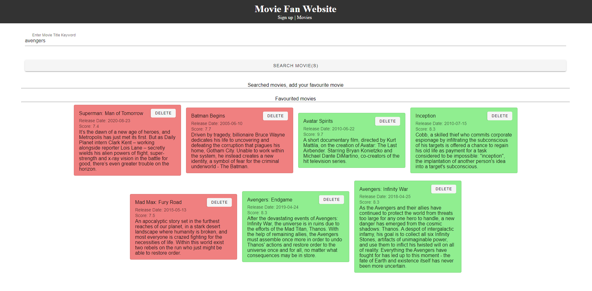

# movie-fan-website

# Project overview

View the website here! https://aurlind.github.io/movie-fan-website/#/movie

This application has an user sign up page and a movies page where an user can create there favourited movie list by searching for a movie using the https://api.themoviedb.org/ database.

Some assumptions I made when looking at the requirements:

I ended up using the search endpoint in TMDB. This query returns a list of movies with the keyword that the user provides. An user can type in "superman" to return a bunch of superman movies or type exactly "Superman: Unbound" to return that specific movie. Because of how large the returned query list can be, I decided it cannot be more than 10 movies that the user can choose from to add to their favourited list.

Assumed requirement 7a) means that the favourited movie list cannot be less than 3 movies or greater than 15 movies. I was not sure if the list should start with 3 movies so I made an error sign telling the user to have at least 3 movies when landing on the page.

Final Thoughts:

This was my first project I created with Vue and had a blast learning it on the fly. My experience with React was really helpful when creating this app as Vue and React are similar. If I had more time to dedicate towards this, I would have looked into having users see a movie image/poster when viewing the information regarding a movie as just looking at plain text can get boring.

## Final Product





## Project setup

```
npm install
```

### Compiles and hot-reloads for development

```
npm run serve
```

### Compiles and minifies for production

```
npm run build
```

### Lints and fixes files

```
npm run lint
```

### Customize configuration

See [Configuration Reference](https://cli.vuejs.org/config/).
